# FED
#WCAG Checklist
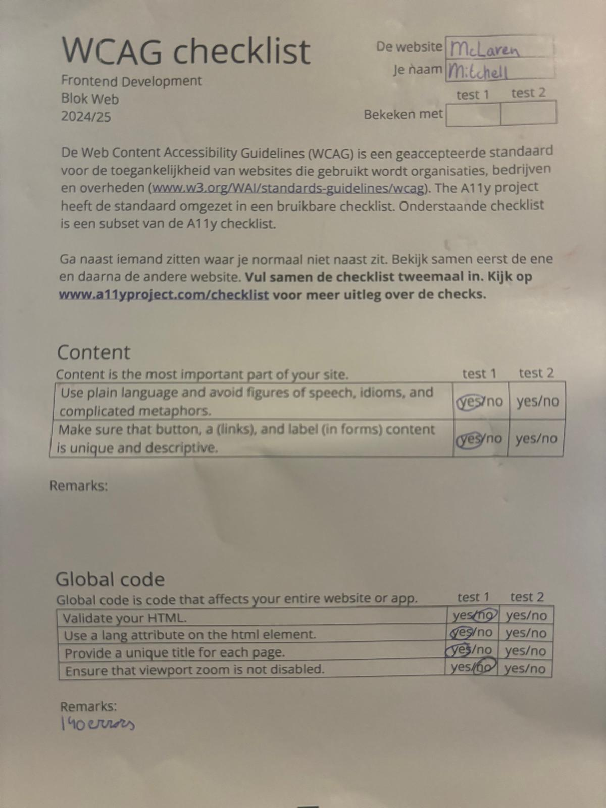
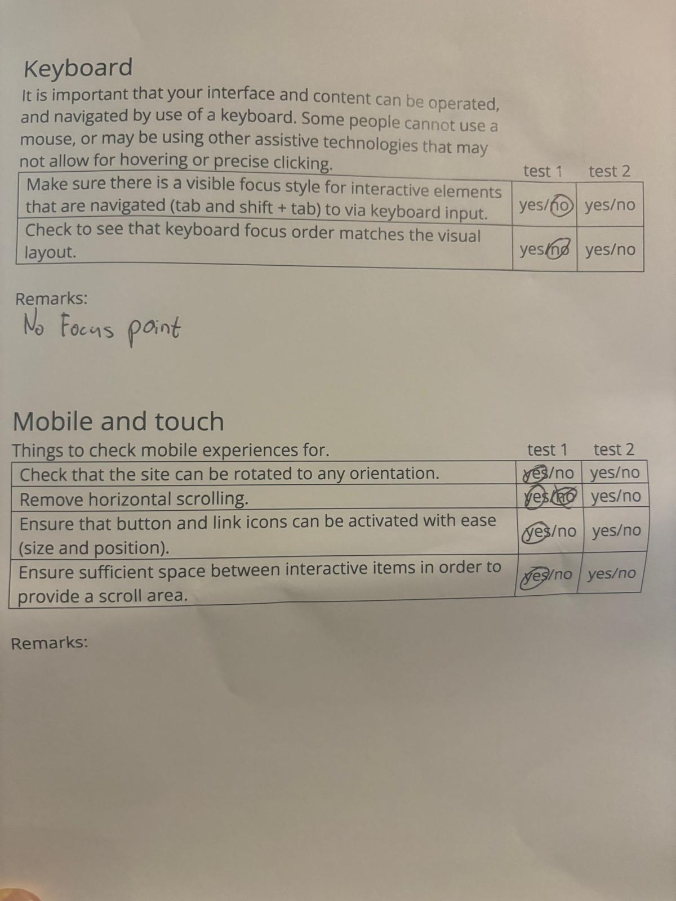
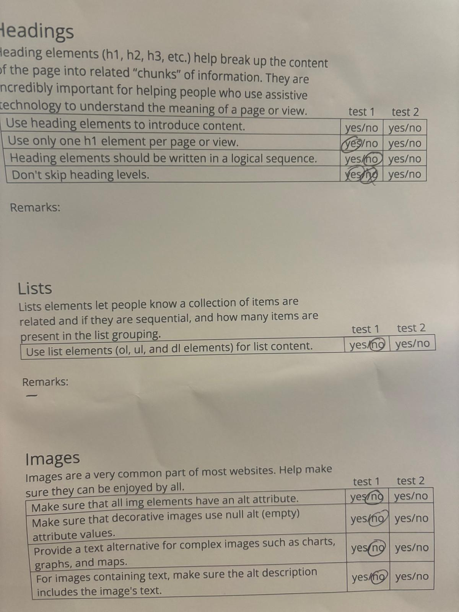
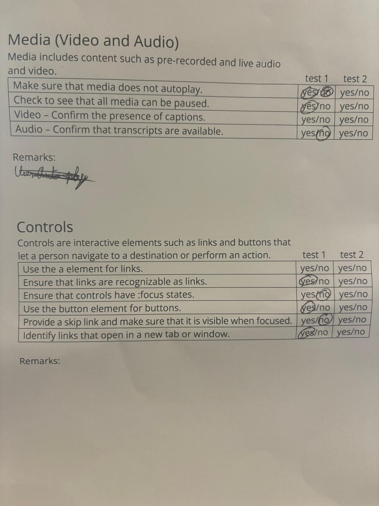
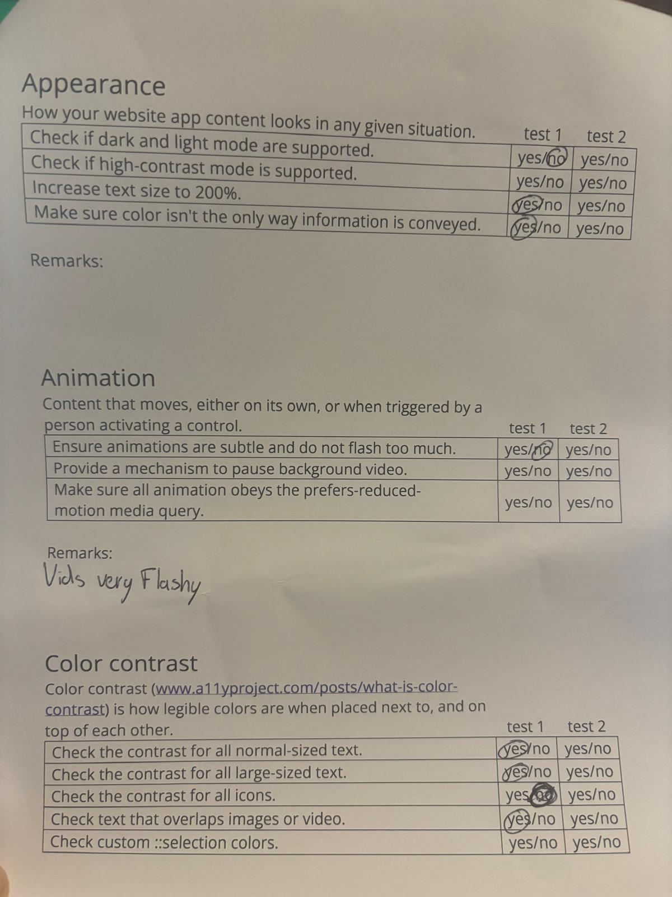

#Schets layout
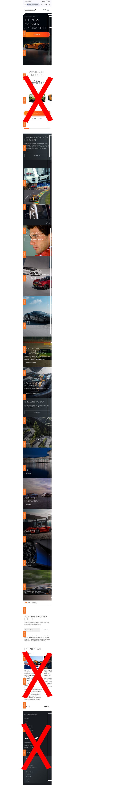
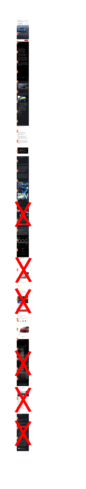

#Eerste voortgang gesprek:
De vragen die ik had met de eerste voortganggesprek had was moet zit deze html code er net uit op het oog van gebruik maken van sections en articles. Hier heb ik namelijk veel moeite mee. Ik programeer normaal namelijk gewoon met divs en dat was bij de deze opdracht niet de boedoeling. Het resultaat op deze vraag was ja. We gingen als groep ook door websites om te kijken wat sections en wat articles en ik wist ze allemaal dus dat gaf genoeg zekerheid voor mezelf. Verder heb ik nog geleerd dat je divs wel mag gebruiken bij bijv een carisol of voor vormgeving en dat je voor een nieuwe pagina de body een class mag geven zodat je in hetzelfde css bestand kan blijven werken.

#Uitkomsten van de Eerste voortgang gesprek:
*Ik snap redelijk goed het verschil tussen article en sections
*Voor vormgeving mag ik divs gebruiken
*Nieuw bestand mag je aanroepen met een class op de body van de tweede pagina

#Vragen bij Tweede voortgang gesprek:
Bij het tweede voorgang gesprek had ik vooral vragen op gebied van mijn paralax effect op de home pagina. Dit heb ik nu opgelost door de achtergrond ook donker te maken net als de achtergrond(img) van de section. De student assistenten zeiden ga zo door zit er goed uit tot nu toe.

#Uitkomsten van de Tweede voortgang gesprek:
*Hoe krijg ik mijn parallax effect mooier
*Ik moet duidelijker zijn voor mezelf welke doelen ik wil behalen
*Ook gaf de student assistent aan dat ik ook voor mijn fonts vh/vw of % kan gebruiken

#Resultaten eigen website WCAG Checklist
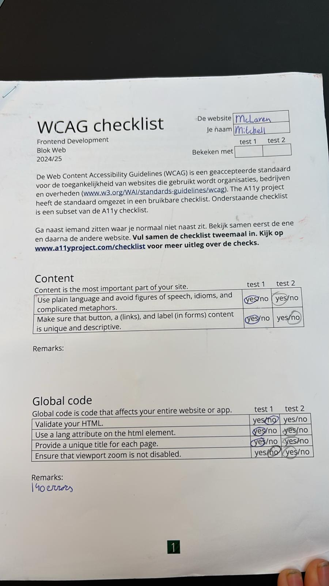
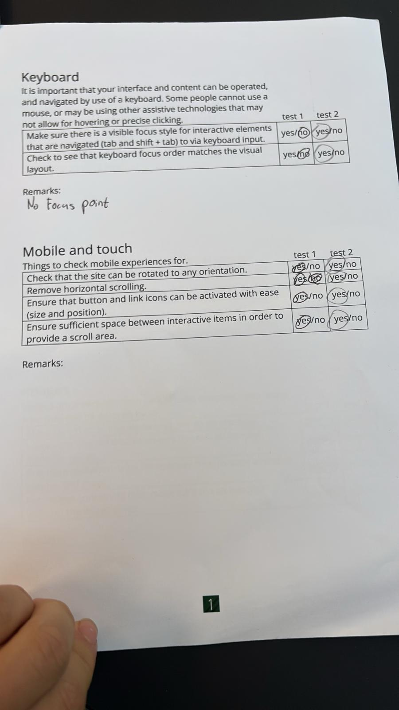
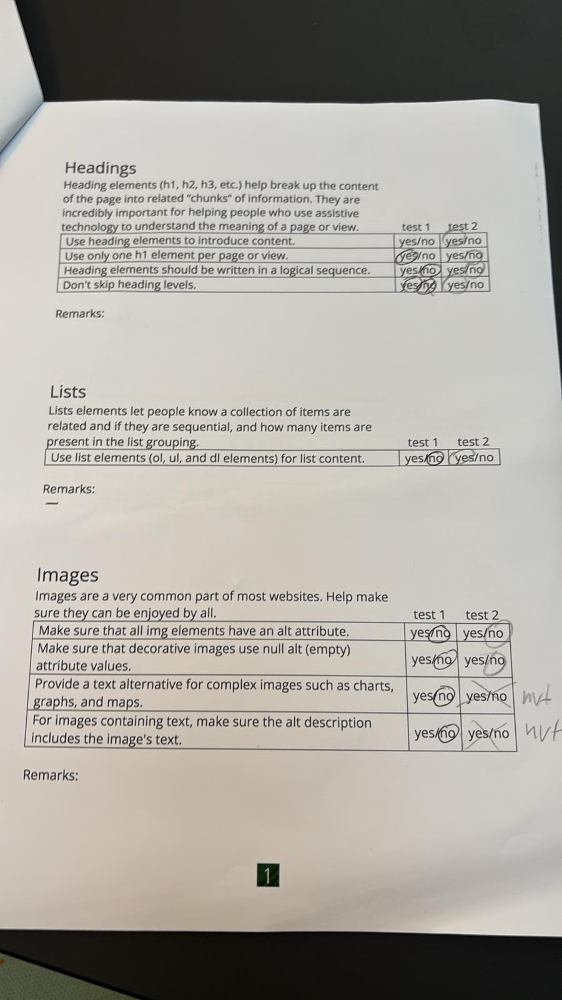
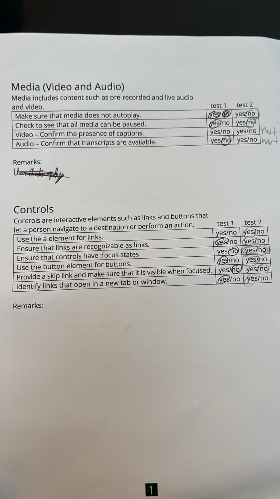
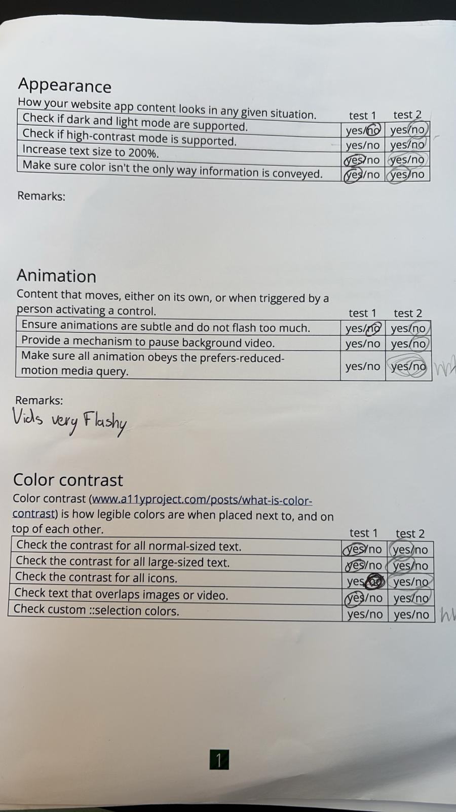

Resultaat zijn een paar dingen waar ik onvoldoende op scoor vooral met de (empty) alts en area-label en het gelijk starten van video's. Maar dit hoort bij de website. Ik zou nog kunnen verzoeken om een pauze knop en play knop te te voegen, maar daar had ik geen tijd meer voor.

#Vragen bij laatste voortgang gesprek:
De vragen die ik heb voor het laatste is of het erg is als sommige imges het niet en of dit eruit ziet als slechte vormgeving?
Antwoorden hierop waren: Ik moest de % veranderen naar iets anders heb dus gekozen voor duidelijke _. Dit komt, omdat de website/mijn JS niet de pagina kon vinden door die spatie.

#Uitkomsten van de Derde voortgang gesprek:
*Je kan geen spaties in de foto's hebben dan wordt het namelijk omgezet naar % en dan kan de browser de img niet vinden
*querySelecter moeten in de JS
*Het is ook mogelijk om in je css een class selector te gebruiken ipv in je html, maar ik heb uiteindelijk toch gekozen om twee css files aan te maken, omdat er zoveel verschil zit in de pagina's.
//[class="page_name"]{
  section:nth-of-type(2){
    background-color: orange;
  }
}
*Ook moet ik nog een CSS animatie erbij doen

#Eindgesprek
Ik ben erg trots op mijn eindresultaat ook al zijn er nog een paar dingen die ik had willen leren, maar echt ver buiten mijn codeer niveau lag. Verder is het ook gelukt met de laser ogen (; 